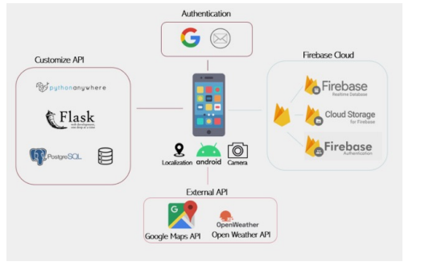
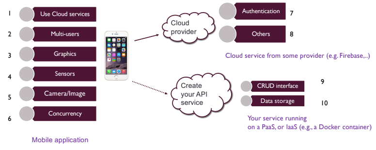

# MACC_project

RadarPhone

- Radar game with two phones (one player searches and the other one hides it). Every x seconds or every minute the position of the hiddenphone is pinged to the radar UI of the main player and he has to try to reach it.
- Once the player reaches the hidden phone he has to take a photo to complete the game.
- Possibility to customize UI colors, nicknames, light and dark mode, etc.
- Take inspiration from standard or more advancved radar images on internet.
- Ai -> algorithm in pythonanywhere that has to recognize and validate the photo of the smartphone found at the end of the game
- Check if he is close and if it is and sends the photo from his cell phone, so we end the game.
- Sql database.
- time constraint of y minutes to win the game, and at least z minutes have to pass to win the game.
- Check how we can implement "online" feature (so how the two people playing communicate with each other, if through a server or P2P)
- balsamiq for mockups.
  

